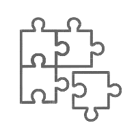

ESP32 教程
=============================================

ESP32 是集成 2.4 GHz Wi-Fi 和蓝牙双模的单芯片方案，采用台积电 (TSMC) 超低功耗的 40 纳米工艺，具有超高的射频性能、稳定性、通用性和可靠性，以及超低的功耗，满足不同的功耗需求，适用于各种应用场景。

* **电脑**：安装 Windows、Linux 或者 Mac 操作系统
* **工具链**：用于编译 ESP32 **应用程序**
* **ESP-IDF**：包含 ESP32 API 和用于操作 **工具链** 的脚本
* **文本编辑器**：编写 C 语言程序，例如 `Eclipse <http://www.eclipse.org/>`_
* **ESP32 开发板** 和将其连接到 **电脑** 的 **USB 线**

如果要购买开发板或者模组，请到我司 `官方淘宝店 <https://anxinke.taobao.com/>`_ 购买。

==================  ==================  ==================
|快速入门|_          |模组选型|_         |API 参考|_
------------------  ------------------  ------------------
`快速入门`_          `模组选型`_         `API 参考`_
------------------  ------------------  ------------------
|API 指南|_          |开源代码|_         |官方论坛|_
------------------  ------------------  ------------------
`API 指南`_          `开源代码`_         `官方论坛`_
==================  ==================  ==================

.. |快速入门| image:: ./_static/get-started.gif
.. _快速入门: https://docs.espressif.com/projects/esp-idf/zh_CN/latest/get-started/index.html

.. |API 参考| image:: ./_static/api-reference.gif
.. _API 参考: https://docs.espressif.com/projects/esp-idf/zh_CN/latest/api-reference/index.html

.. |模组选型| image:: ./_static/hw-reference.gif
.. _模组选型: modules/modules.html

.. |API 指南| image:: ./_static/api-guides.gif
.. _API 指南: https://docs.espressif.com/projects/esp-idf/zh_CN/latest/api-guides/index.html

.. _开源代码: https://github.com/Ai-Thinker-Open

.. |官方论坛| image:: ./_static/resources.gif
.. _官方论坛: http://bbs.ai-thinker.com/forum.php

.. toctree::
   :maxdepth: 2
   :caption: 简介:

   简介 <index>
   开发板选型 <boards/boards.rst>

.. toctree::
   :maxdepth: 2
   :caption: 入门:

   搭建环境 <introduce>
   其他 <get-started/index>

.. toctree::
   :maxdepth: 2
   :caption: 模组选型:

   模组选型 <modules/modules>
   ESP32-S <modules/ESP32_S>
   ESP32-A1S <modules/ESP32_A1S>
   ESP32-WROOM-32 <modules/ESP32_WROOM_32>

.. toctree::
   :maxdepth: 2
   :caption: 开发板选型:

   开发板选型 <board/boards>
   ESP32-Audio-Kit <board/ESP32-Audio-Kit>
   ESP32-CAM <board/ESP32-CAM>
   NodeMCU-32S <board/NodeMCU-32S>

Indices and tables
==================

* :ref:`genindex`
* :ref:`modindex`
* :ref:`search`
